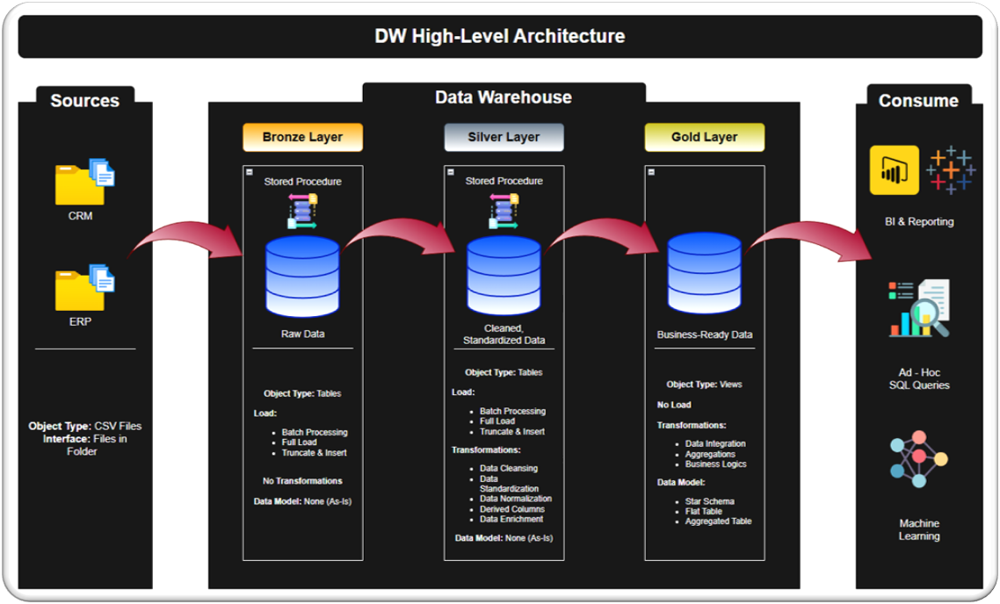

# SQL Data Warehouse Project  

**Building a modern data warehouse with SQL, including ETL processes, data modeling, and analytics.**  

Welcome to the **Data Warehouse and Analytics Project** repository!  
This project demonstrates a comprehensive data warehousing and analytics solution, from building a data warehouse to generating actionable insights. Designed as a portfolio project, it highlights industry best practices in data engineering and analytics.

## Project Overview

This project involves:

1. **Data Architecture**: Designing a Modern Data Warehouse Using Medallion Architecture **Bronze**, **Silver**, and **Gold** layers.
2. **ETL Pipelines**: Extracting, transforming, and loading data from source systems into the warehouse.
3. **Data Modeling**: Developing fact and dimension tables optimized for analytical queries.
4. **Analytics & Reporting**: Creating SQL-based reports and dashboards for actionable insights.

## Data Architecture

The data architecture for this project follows Medallion Architecture **Bronze**, **Silver**, and **Gold** layers:  

1. **Bronze Layer**: Stores raw data as-is from the source systems. Data is ingested from CSV Files into PostgreSQL database in a containerized environment.
2. **Silver Layer**: This layer includes data cleansing, standardization, and normalization processes to prepare data for analysis.
3. **Gold Layer**: Houses business-ready data modeled into a star schema required for reporting and analytics.

***   

**NOTE:** *This content is a guided project. I created my own version of the project using SQL, PostgreSQL and Docker.     
Thanks to Data With Baraa for providing the instructions.* 

***  
## About Me

Hey, folks! **John** here!  
I'm a **project management professional** and **data analyst** enthusiast.  
Let's connect on LinkedIn!  
See ya!  

